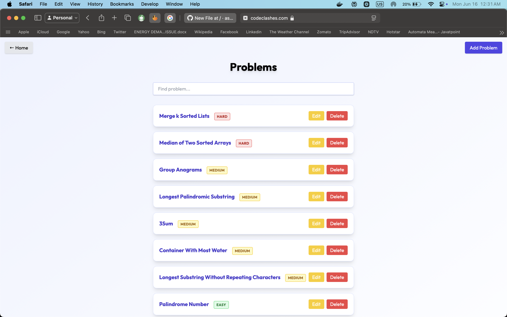

  
  <h1 align="center">🚀 CodeClash – Ultimate Coding Platform with AI Integration</h1>
  

    <b>Full-stack, AI-powered online judge & coding platform</b> 
    <i>Modern, scalable, and built for real-world developer experience.</i>
  

  
  
   
  
  
  

---

## ✨ Animated Preview

  <!-- Replace with your actual GIF if available -->
  

---

## 🌟 Why CodeClash?

- **Modern, mobile-first UI** with smooth animations and dark mode.
- **Real-time code execution** with Monaco Editor for a VS Code-like feel.
- **AI-powered coding assistant:** Get instant code reviews, bug hints, and explanations.
- **Competitive contests:** Live leaderboard, fair scoring, and robust anti-cheat.
- **Secure authentication:** Email, Google OAuth, OTP, and JWT-based sessions.
- **Scalable cloud deployment:** Runs on AWS ECS, S3, CloudFront, and MongoDB Atlas.
- **Built for learning:** Clean codebase, modular architecture, and easy to extend.

---

## 🚀 Live Demo

- **🌐 Website:** [https://codeclashes.com](https://codeclashes.com)
- **🎥 Demo Video:** [Watch on Loom](https://www.loom.com/share/69532af4754a40c984d7b90888f44ae7?sid=2c466789-1a85-46d1-a519-192a721f8558)

---

## 🖼️ Screenshots

  
  
  
  
  
  
  

---

## 🏆 Features

- 🔐 **Authentication:** Email, Google, OTP, JWT cookies
- 📝 **Problem List:** Filter by tags, difficulty, and search
- 💻 **Monaco Editor:** Syntax highlighting, themes, auto-complete
- ⚡ **Custom Compiler:** Multi-language support, safe sandboxing
- 🤖 **AI Assistance:** Code review, bug finder, and hints (Gemini API)
- 🏅 **Contests:** Create/join, live leaderboard, timer
- 📈 **Profile:** Track solved problems, stats, and progress
- 📬 **Email Notifications:** OTP, registration, password reset (Brevo)
- 🛡️ **Security:** Input validation, rate limiting, CORS, helmet
- 📱 **Responsive:** Smooth on all devices

---

## 🛠️ Tech Stack

| Frontend      | Backend        | DevOps / Cloud         | AI & Tools      |
|---------------|---------------|------------------------|-----------------|
| React (Vite)  | Node.js       | Docker                 | Google Gemini   |
| Tailwind CSS  | Express.js    | AWS ECS, ECR, S3       | Nodemailer      |
| Axios         | MongoDB Atlas | AWS CloudFront, Route53| Brevo (SMTP)    |
| React Router  | JWT           | GitHub Actions (CI/CD) |                 |
| Monaco Editor |               |                        |                 |

---

## 📦 How to Clone & Run Locally

### 1. **Clone the repo**
git clone https://github.com/asifmohammed786/CodeClash-Ultimate-Coding-Platform-with-AI-integration.git
cd CodeClash-Ultimate-Coding-Platform-with-AI-integration

### 2. **Setup Environment Variables**
- Copy `.env.example` to `.env` in both `/server` and `/client`.
- Fill in your API keys, MongoDB URI, JWT secret, SMTP credentials, etc.

### 3. **Run Backend**
cd server

npm install

npm run dev

### 4. **Run Frontend**
cd ../client
npm install
npm run dev
- Open [http://localhost:3000](http://localhost:3000)

### 5. **(Optional) Run with Docker Compose**
docker-compose up –build

---

## 🌐 Production Deployment

- **Backend:** Dockerized, deployed to AWS ECS (Elastic Container Service)
- **Frontend:** Built with Vite, hosted on AWS S3 + CloudFront
- **Domain:** [https://codeclashes.com](https://codeclashes.com) (Route53 DNS)
- **Email/OTP:** Brevo (Sendinblue) SMTP, verified sender

---

## 👨‍💻 For Recruiters

> **Why should you check out CodeClash?**
>
> - **Real-world, cloud-native architecture:** Shows DevOps, Docker, AWS, and CI/CD skills.
> - **Modern UI/UX:** Built with React, Tailwind, and Monaco Editor for a delightful user experience.
> - **AI integration:** Demonstrates ability to work with LLMs and external APIs.
> - **Security best practices:** JWT, cookies, CORS, rate limiting, and input validation.
> - **Team-ready:** Modular code, RESTful APIs, and clear documentation.
>
> **Try the live demo, or run locally in minutes!**

---

## 📬 Contact

- **Email:** asifmohammed85113@gmail.com
- **LinkedIn:** [Your LinkedIn](https://linkedin.com/in/yourprofile)
- **Portfolio:** [Your Portfolio Link](https://your-portfolio.com)

---

  

